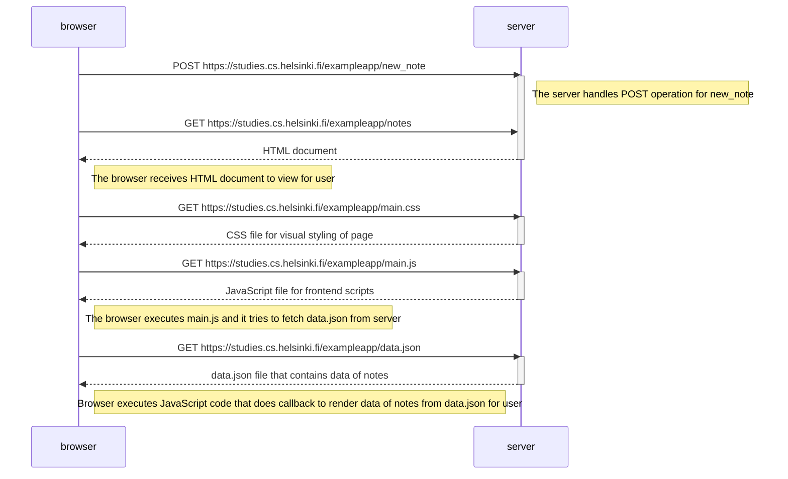

```mermaid
sequenceDiagram
	participant browser
	participant server
	
	browser->>server: POST https://studies.cs.helsinki.fi/exampleapp/new_note 
	activate server
	Note right of server: The server handles POST operation for new_note
	browser->>server: GET https://studies.cs.helsinki.fi/exampleapp/notes
	server-->>browser: HTML document
	deactivate server
	Note right of browser: The browser receives HTML document to view for user
	
	browser->>server: GET https://studies.cs.helsinki.fi/exampleapp/main.css
	activate server
	server-->>browser: CSS file for visual styling of page
	deactivate server
	
	browser->>server: GET https://studies.cs.helsinki.fi/exampleapp/main.js
	activate server
	server-->>browser: JavaScript file for frontend scripts
	deactivate server
	Note right of browser: The browser executes main.js and it tries to fetch data.json from server
	
	browser->>server: GET https://studies.cs.helsinki.fi/exampleapp/data.json
	activate server
	server-->>browser: data.json file that contains data of notes
	deactivate server
	Note right of browser: Browser executes JavaScript code that does callback to render data of notes from data.json for user
```